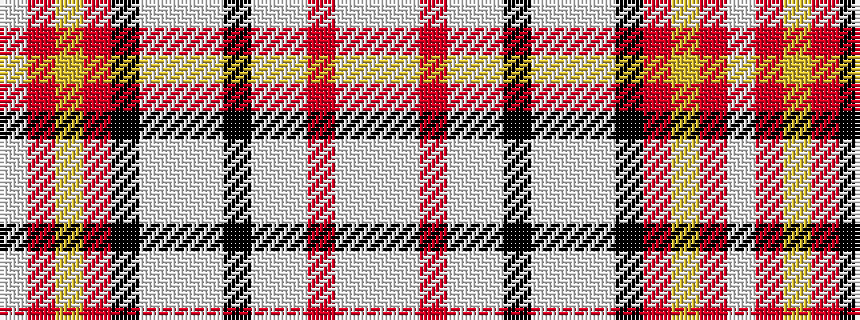

WRYRKWWWKWWRWW

It is a 14 stripe tartan.

<figure class="pat-woven">

<figcaption>idealised sample</figcaption>
</figure>

## Colour Sequence



## Tartans with this colour sequence

| Tartans |
|---------------|
| [Praetorian](/setts/s14/w1r1ly1r8k1lb1w8lb1k8lb1w1r8lb1w1~x6/)|
||
