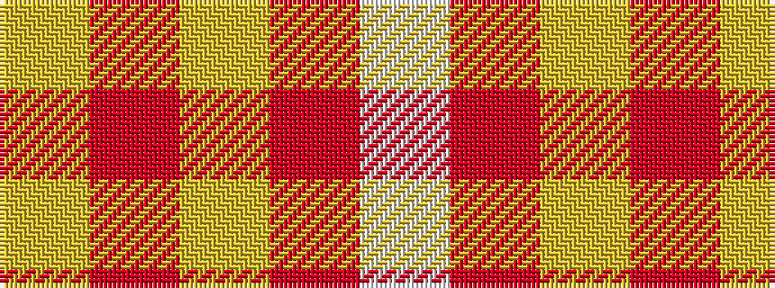

WRYRY

It is a 5 stripe tartan.

<figure class="pat-woven">

<figcaption>idealised sample</figcaption>
</figure>

## Colour Sequence



## Tartans with this colour sequence

| Tartans |
|---------------|
| [Amber Rose (Fashion)](/setts/s5/w1o6loi4o4lo1~x10/)|
||
