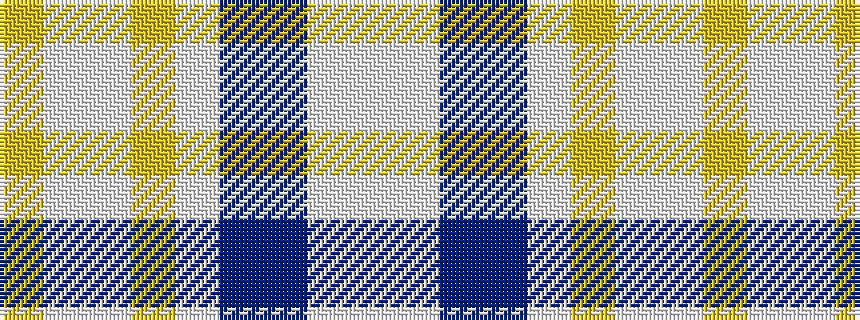

WWBBWYWWY

It is a 9 stripe tartan.

<figure class="pat-woven">

<figcaption>idealised sample</figcaption>
</figure>

## Colour Sequence



## Tartans with this colour sequence

| Tartans |
|---------------|
| [Queensferry High (School)](/setts/s9/lr5lbi3lb7lr5lb27b8dt43w3lb3/)|
||
