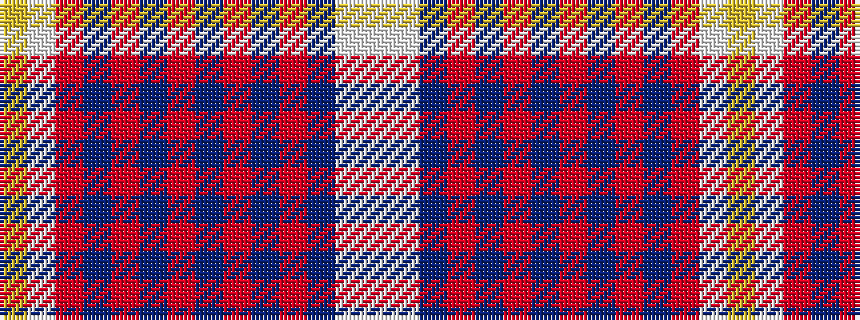

WWBRBRBRBRBRWY

It is a 14 stripe tartan.

<figure class="pat-woven">

<figcaption>idealised sample</figcaption>
</figure>

## Colour Sequence



## Tartans with this colour sequence

| Tartans |
|---------------|
| [Kiltwalk](/variants/s14/w8lb2db52r2db3r2db3r3db2r3db2r8lb8ly8/)|
||
