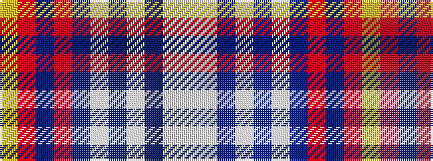

WWBWBWBRBRY

It is a 11 stripe tartan.

<figure class="pat-woven">

<figcaption>idealised sample</figcaption>
</figure>

## Colour Sequence



## Tartans with this colour sequence

| Tartans |
|---------------|
| [Shanghai Scottish](/setts/s11/w4lt13dbi5lt8dbi27lt15db16r3db3r23ly4/)|
||
