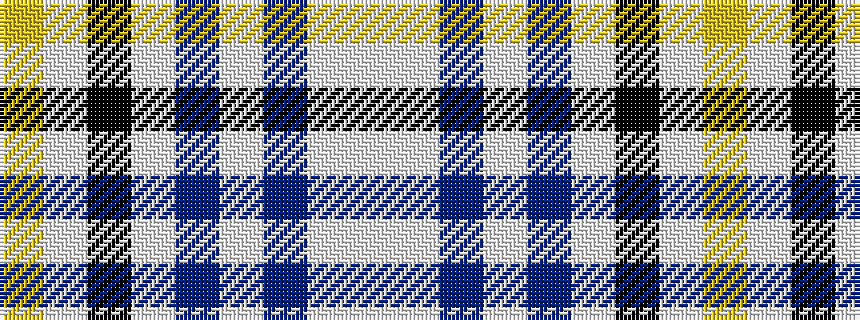

WWBWBWKWY

It is a 9 stripe tartan.

<figure class="pat-woven">

<figcaption>idealised sample</figcaption>
</figure>

## Colour Sequence



## Tartans with this colour sequence

| Tartans |
|---------------|
| [Royal College of Midwives](/setts/s9/ly5lb3k1lb6n11lb3b3lb43w3~x2/)|
||
