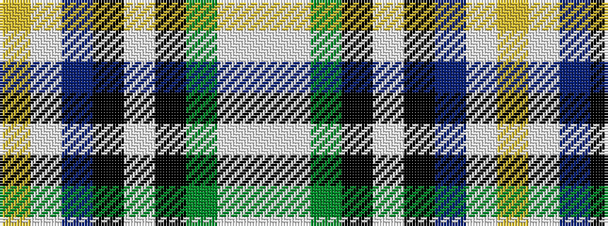

WWGKWKBWY

It is a 9 stripe tartan.

<figure class="pat-woven">

<figcaption>idealised sample</figcaption>
</figure>

## Colour Sequence



## Tartans with this colour sequence

| Tartans |
|---------------|
| [Hek Family (Sunningdale, Berwick on Tweed)](/variants/s9/ly1lt2n15k2lt2k2g12w2lt1~x2/)|
||
