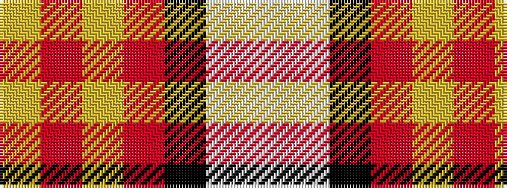

WWKRYRY

It is a 7 stripe tartan.

<figure class="pat-woven">

<figcaption>idealised sample</figcaption>
</figure>

## Colour Sequence



## Tartans with this colour sequence

| Tartans |
|---------------|
| [Oor Wullie (Corporate)](/setts/s7/lyi3r3ly2r20k16lb24w2~x2/)|
||
| [Oor Wullie (DC Thomson)](/setts/s7/ly3r3lo2r20k16wi24w2~x2/)|
||
