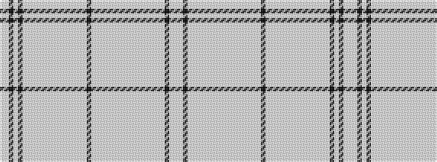

WWKWKWWWWWWWWWWWWWWKWWWWWWWWWWWWWWWWKWW

It is a 39 stripe tartan.

<figure class="pat-woven">

<figcaption>idealised sample</figcaption>
</figure>

## Colour Sequence



## Tartans with this colour sequence

| Tartans |
|---------------|
| [Shapiro (Personal)](/setts/s39/lb16lb4k6lb10lb3lb28lb2lb10lb4lb10lb6lb10lb6lb10lb6lb10lb10lb4lb10k4lb10lb2lb32lb1lb1lb10lb4lb10lb4lb10lb6lb10lb6lb4k10lb2k2lb2lp16~x2/)|
||
