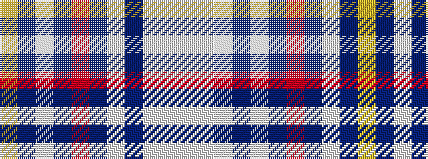

WWWBWBRBWBY

It is a 11 stripe tartan.

<figure class="pat-woven">

<figcaption>idealised sample</figcaption>
</figure>

## Colour Sequence



## Tartans with this colour sequence

| Tartans |
|---------------|
| [Vilaro-Thomas (Personal)](/setts/s11/ly2db26lb3db3r1db3lb7db6lb15w1lb2~x2/)|
||
