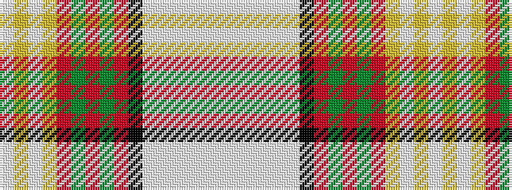

WWWWWWKRGRGRYWYW

It is a 16 stripe tartan.

<figure class="pat-woven">

<figcaption>idealised sample</figcaption>
</figure>

## Colour Sequence



## Tartans with this colour sequence

| Tartans |
|---------------|
| [Inverness County (Canada)](/variants/s16/lb18ly2lb2ly1r3g3r2g2r1k2lb3w7lb2w2lb1w4~x4/)|
||
