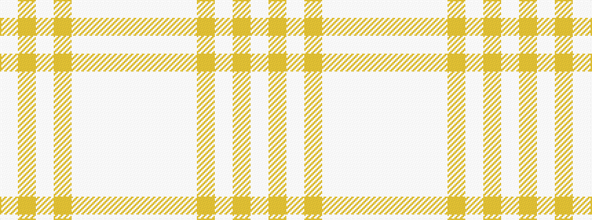

WWWWYWYW

It is a 8 stripe tartan.

<figure class="pat-woven">

<figcaption>idealised sample</figcaption>
</figure>

## Colour Sequence



## Tartans with this colour sequence

| Tartans |
|---------------|
| [Amazon](/variants/s8/w8wi30w60wi15lo2wi2lo2wi5~x2/)|
||
| [Amazon](/variants/s8/w8lb30w60lb15lo2lb2lo2lb5~x2/)|
||
