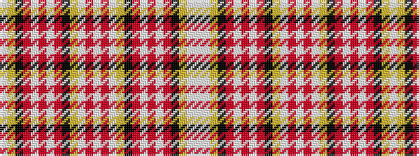

WWYKRWRWRKYWRWRWYKRWRWRKYW

It is a 26 stripe tartan.

<figure class="pat-woven">

<figcaption>idealised sample</figcaption>
</figure>

## Colour Sequence



## Tartans with this colour sequence

| Tartans |
|---------------|
| [Ogilvie (D.C. Stewart) #2](/variants/s26/lb6ly2k2r9w2r6w2r9k2ly2lb6r2lb6r2lb6ly2k2r9w2r6w2r9k2ly2lb6w2~x2/)|
||
