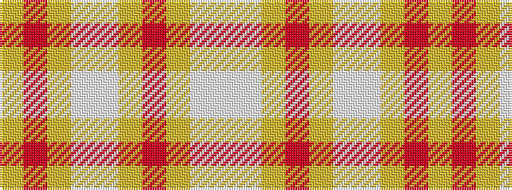

WWYRYWWYRY

It is a 10 stripe tartan.

<figure class="pat-woven">

<figcaption>idealised sample</figcaption>
</figure>

## Colour Sequence



## Tartans with this colour sequence

| Tartans |
|---------------|
| [Banatherton Union](/setts/s10/lg10o8ly1lb5w5lg28o2ly1lb8w5~x2/)|
||
