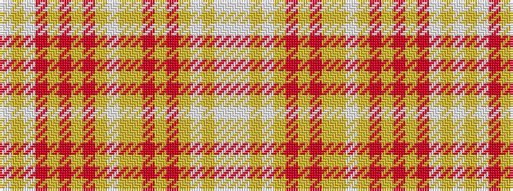

WWYWYRYRYYWYRYRYRWYW

It is a 20 stripe tartan.

<figure class="pat-woven">

<figcaption>idealised sample</figcaption>
</figure>

## Colour Sequence



## Tartans with this colour sequence

| Tartans |
|---------------|
| [elCorte](/variants/s20/w6lt5lg4lt5lo2r5lg2r14lg10lo30lt1lg2r4lg2r1lo30r10lt14lg2lt5~x2/)|
||
