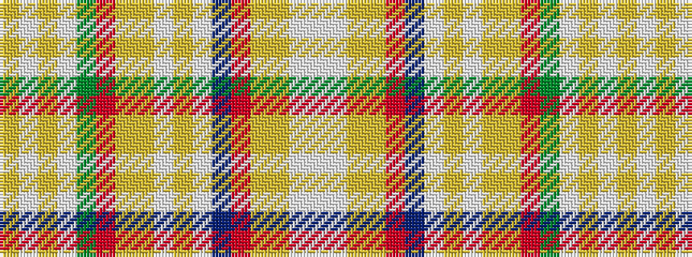

WWYYRBWYWYYRGWYWY

It is a 17 stripe tartan.

<figure class="pat-woven">

<figcaption>idealised sample</figcaption>
</figure>

## Colour Sequence



## Tartans with this colour sequence

| Tartans |
|---------------|
| [Ste-Anne-de-Portneuf](/variants/s17/lo2w3loi7lt1dy4r2ly6lg2w1loi2lt6do2r4ly1lg7w3lt2~x4/)|
||
