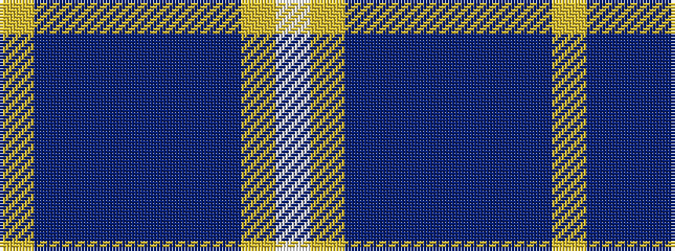

WYBBBBBBY

It is a 9 stripe tartan.

<figure class="pat-woven">

<figcaption>idealised sample</figcaption>
</figure>

## Colour Sequence



## Tartans with this colour sequence

| Tartans |
|---------------|
| [Blue Knights, The](/variants/s9/w3lg15dbi6db2dbi1db2dbi1db21ly2~x2/)|
||
