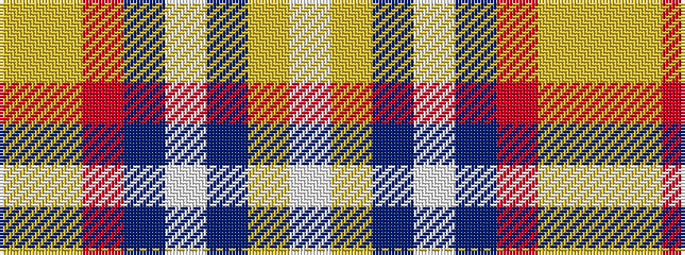

WYBWBRYY

It is a 8 stripe tartan.

<figure class="pat-woven">

<figcaption>idealised sample</figcaption>
</figure>

## Colour Sequence



## Tartans with this colour sequence

| Tartans |
|---------------|
| [Isle of Jura](/variants/s8/lb12lg12db7w1do5o5lo2ly2~x2/)|
||
