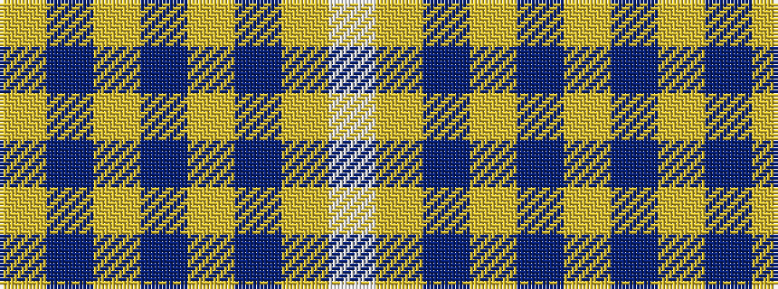

WYBYBYBY

It is a 8 stripe tartan.

<figure class="pat-woven">

<figcaption>idealised sample</figcaption>
</figure>

## Colour Sequence



## Tartans with this colour sequence

| Tartans |
|---------------|
| [Morris Welsh Name Tartan](/variants/s8/w6ly3db3ly2db3ly4db48ly4/)|
||
| [Morris of Wales](/variants/s8/w4ly3db3ly2db3ly4db48ly4/)|
||
