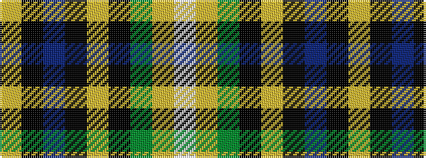

WYGKYKBKY

It is a 9 stripe tartan.

<figure class="pat-woven">

<figcaption>idealised sample</figcaption>
</figure>

## Colour Sequence



## Tartans with this colour sequence

| Tartans |
|---------------|
| [MacManus (Estimated threadcount)](/variants/s9/w3ly2g8k2ly3k2db15k1ly2~x4/)|
||
