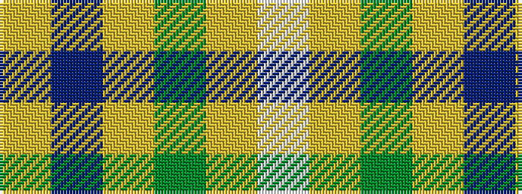

WYGYBY

It is a 6 stripe tartan.

<figure class="pat-woven">

<figcaption>idealised sample</figcaption>
</figure>

## Colour Sequence



## Tartans with this colour sequence

| Tartans |
|---------------|
| [Fraser Yellow #2](/variants/s6/w1ly8dg3ly1db3ly1~x4/)|
||
| [Fraser, Yellow](/variants/s6/w1ly8g3ly1db3ly1~x4/)|
||
