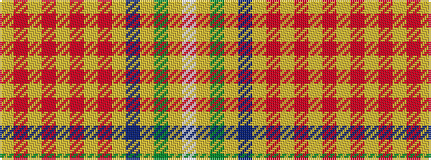

WYGYBYRYRYRYRY

It is a 14 stripe tartan.

<figure class="pat-woven">

<figcaption>idealised sample</figcaption>
</figure>

## Colour Sequence



## Tartans with this colour sequence

| Tartans |
|---------------|
| [Catalan (92 Olympics)](/variants/s14/ly44r6ly6r6ly6r6ly6r6ly44b3ly3g3ly3lb3/)|
||
