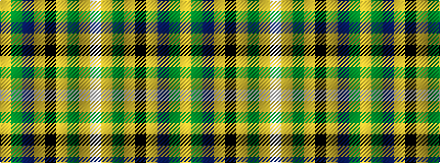

WYGYKYBGY

It is a 9 stripe tartan.

<figure class="pat-woven">

<figcaption>idealised sample</figcaption>
</figure>

## Colour Sequence



## Tartans with this colour sequence

| Tartans |
|---------------|
| [State Seal of Kansas (Fashion)](/variants/s9/lo5g23b21loi30k10loi4g4loi16lb3~x2/)|
||
