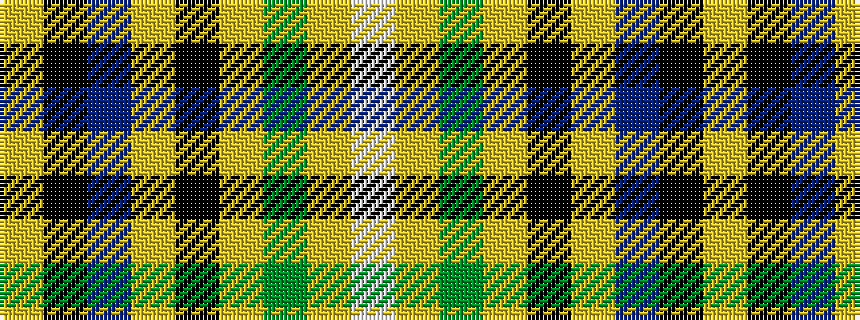

WYGYKYBKY

It is a 9 stripe tartan.

<figure class="pat-woven">

<figcaption>idealised sample</figcaption>
</figure>

## Colour Sequence



## Tartans with this colour sequence

| Tartans |
|---------------|
| [MacManus](/setts/s9/w3ly2g8ly2k3ly2n15k1ly2~x4/)|
||
