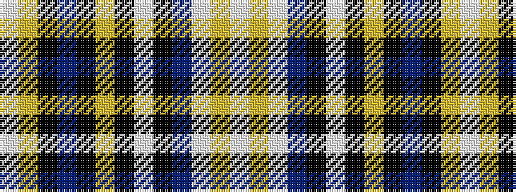

WYKBKYKWKBWYW

It is a 13 stripe tartan.

<figure class="pat-woven">

<figcaption>idealised sample</figcaption>
</figure>

## Colour Sequence



## Tartans with this colour sequence

| Tartans |
|---------------|
| [Freger](/variants/s13/w1ly2k8dp6k15ly1k1w1k15dp5w8ly1w1~x2/)|
||
