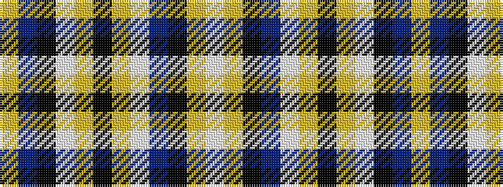

WYKBWYKYWKBY

It is a 12 stripe tartan.

<figure class="pat-woven">

<figcaption>idealised sample</figcaption>
</figure>

## Colour Sequence



## Tartans with this colour sequence

| Tartans |
|---------------|
| [MacGill of Jura (Clan?)](/variants/s12/lo45t24k15w2lo2k1lo2w2t11k3lo4w8~x2/)|
||
