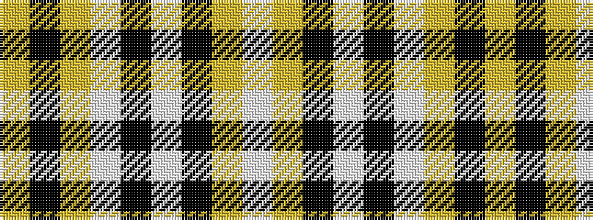

WYKWKWYKY

It is a 9 stripe tartan.

<figure class="pat-woven">

<figcaption>idealised sample</figcaption>
</figure>

## Colour Sequence



## Tartans with this colour sequence

| Tartans |
|---------------|
| [Moonlight Glen (Fashion)](/variants/s9/w3lr1k3w10k10w6lr4k40lr3~x2/)|
||
