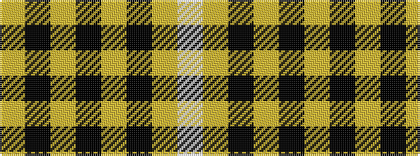

WYKYKYKY

It is a 8 stripe tartan.

<figure class="pat-woven">

<figcaption>idealised sample</figcaption>
</figure>

## Colour Sequence



## Tartans with this colour sequence

| Tartans |
|---------------|
| [Johnston Orange/Black (Corporate)](/setts/s8/w1lo1k1lo12k12lo1k1lo1~x4/)|
||
