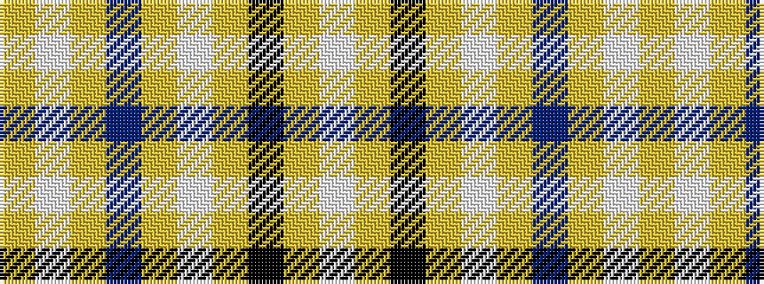

WYKYWYBYWY

It is a 10 stripe tartan.

<figure class="pat-woven">

<figcaption>idealised sample</figcaption>
</figure>

## Colour Sequence



## Tartans with this colour sequence

| Tartans |
|---------------|
| [London Fog Camel 2 (Fashion)](/variants/s10/lr3lb2lr18t9lr18lb2lr18k9lr18lb2/)|
||
