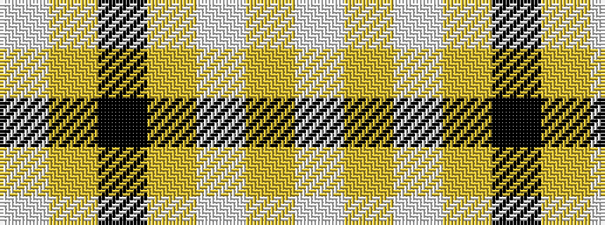

WYKYWYW

It is a 7 stripe tartan.

<figure class="pat-woven">

<figcaption>idealised sample</figcaption>
</figure>

## Colour Sequence



## Tartans with this colour sequence

| Tartans |
|---------------|
| [Angle, Blue (Fashion)](/setts/s7/lb1lg11k6lg3lb1lg1lb1~x4/)|
||
