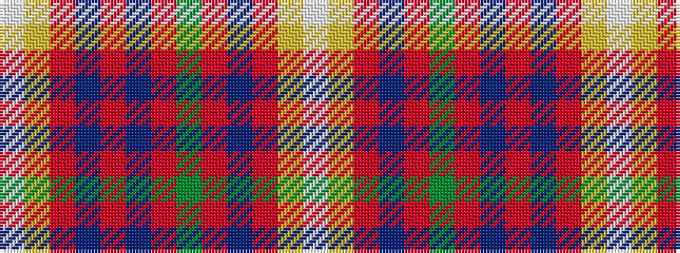

WYRBRBRGRBRYW

It is a 13 stripe tartan.

<figure class="pat-woven">

<figcaption>idealised sample</figcaption>
</figure>

## Colour Sequence



## Tartans with this colour sequence

| Tartans |
|---------------|
| [Robbie (Commemorative)](/variants/s13/w1lo2r15db2r2db15r2g15r2db2r15lo2w1~x2/)|
||
| [Robbie (Stirling) (Personal)](/variants/s13/w1ly2r15db2r2db15r2g15r2db2r15ly2w1~x2/)|
||
