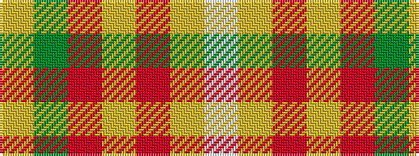

WYRYRGY

It is a 7 stripe tartan.

<figure class="pat-woven">

<figcaption>idealised sample</figcaption>
</figure>

## Colour Sequence



## Tartans with this colour sequence

| Tartans |
|---------------|
| [Aberdeenshire Home Colours](/setts/s7/lb19lo12m4lo8o4g6lg16~x2/)|
||
