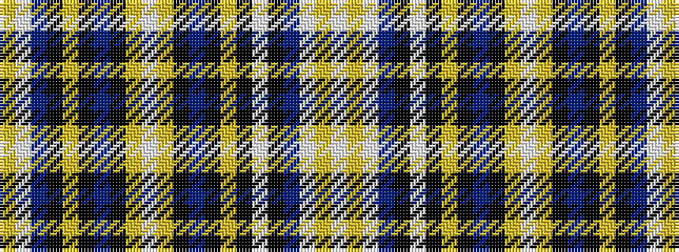

WYWBKWKYKBKYWYKBKYKBWY

It is a 22 stripe tartan.

<figure class="pat-woven">

<figcaption>idealised sample</figcaption>
</figure>

## Colour Sequence



## Tartans with this colour sequence

| Tartans |
|---------------|
| [Freger (Corporate)](/variants/s22/w2ly2w15dp10k23w2k2ly2k23dp10k15ly2w2ly2k15dp10k23ly2k23dp10w15ly2~x2/)|
||
