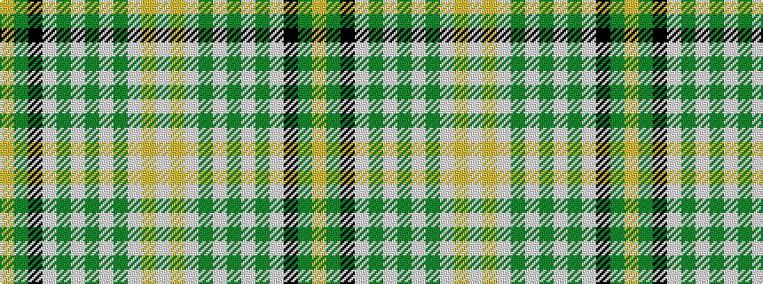

WYWGWGWGWKGY

It is a 12 stripe tartan.

<figure class="pat-woven">

<figcaption>idealised sample</figcaption>
</figure>

## Colour Sequence



## Tartans with this colour sequence

| Tartans |
|---------------|
| [Breifne](/variants/s12/lr3dg18k4lb12dg2lb3dg2lb3dg2lb12lr4lb3~x2/)|
||
