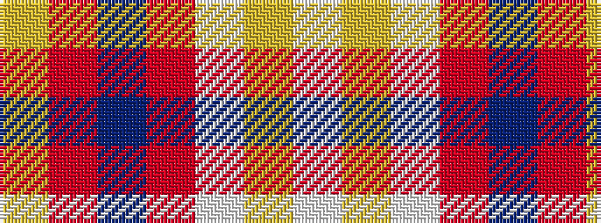

WYWRBRY

It is a 7 stripe tartan.

<figure class="pat-woven">

<figcaption>idealised sample</figcaption>
</figure>

## Colour Sequence



## Tartans with this colour sequence

| Tartans |
|---------------|
| [Torridon, Burgundy (Dance)](/setts/s7/w3lg2w30r30n2r2lg3~x2/)|
||
