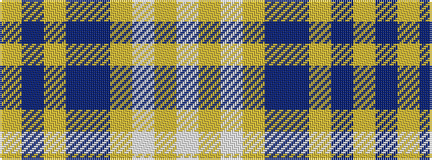

WYWYBBYBY

It is a 9 stripe tartan.

<figure class="pat-woven">

<figcaption>idealised sample</figcaption>
</figure>

## Colour Sequence



## Tartans with this colour sequence

| Tartans |
|---------------|
| [Sean F Forrester (Personal)](/setts/s9/w3lr4w1lr15p24do15ly1do4ly3~x4/)|
||
