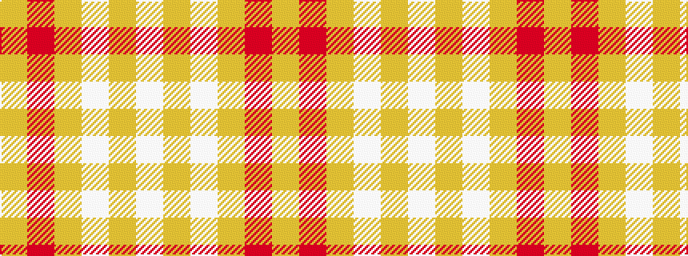

WYWYRY

It is a 6 stripe tartan.

<figure class="pat-woven">

<figcaption>idealised sample</figcaption>
</figure>

## Colour Sequence



## Tartans with this colour sequence

| Tartans |
|---------------|
| [Virgin One](/variants/s6/lo11r2lo11w6lo7w6~x2/)|
||
