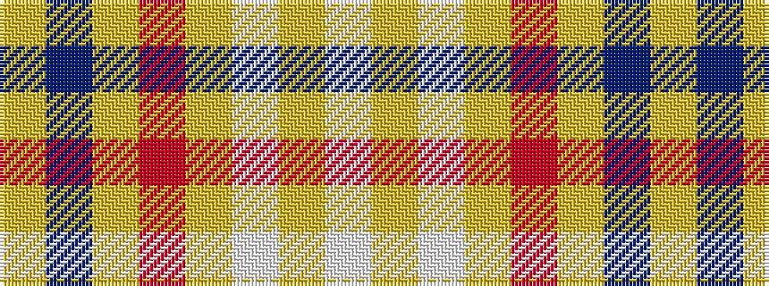

WYWYRYBY

It is a 8 stripe tartan.

<figure class="pat-woven">

<figcaption>idealised sample</figcaption>
</figure>

## Colour Sequence



## Tartans with this colour sequence

| Tartans |
|---------------|
| [Weaving for Life](/setts/s8/lr24n2lr6m3lr6w6lr6w6~x2/)|
||
