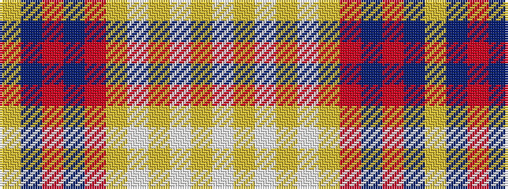

WYWYWYRBRBY

It is a 11 stripe tartan.

<figure class="pat-woven">

<figcaption>idealised sample</figcaption>
</figure>

## Colour Sequence



## Tartans with this colour sequence

| Tartans |
|---------------|
| [Ben Vorlich](/setts/s11/w68lr3w3lr8w3lr3o24dt16oi3dt20lr3~x2/)|
||
