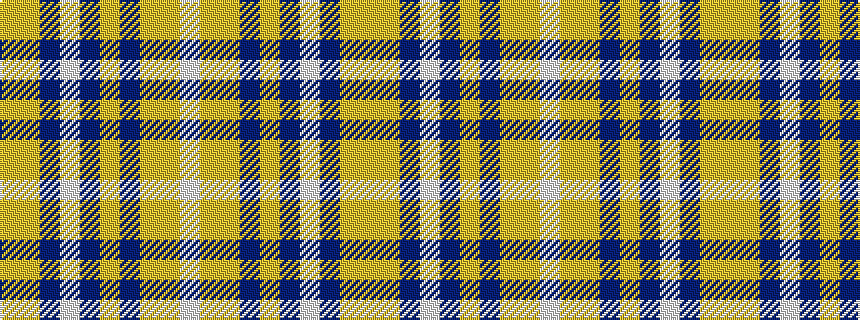

WYYBYBWBYY

It is a 10 stripe tartan.

<figure class="pat-woven">

<figcaption>idealised sample</figcaption>
</figure>

## Colour Sequence



## Tartans with this colour sequence

| Tartans |
|---------------|
| [Bruce of Kinnaird (Fashion)](/variants/s10/loi22ly22dr2lb6dr2lo2dr16lg5loi8lb2~x2/)|
||
