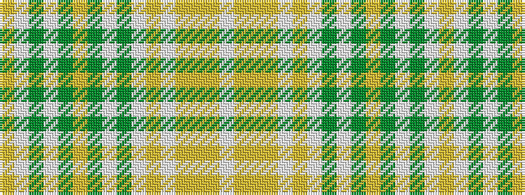

WYYYWYWGWGYGWGWY

It is a 16 stripe tartan.

<figure class="pat-woven">

<figcaption>idealised sample</figcaption>
</figure>

## Colour Sequence



## Tartans with this colour sequence

| Tartans |
|---------------|
| [Langara College](/setts/s16/w120lr5lo4lr5w40lr30w1y1w2y4lo8y10w20y30w40lr60~x2/)|
||
