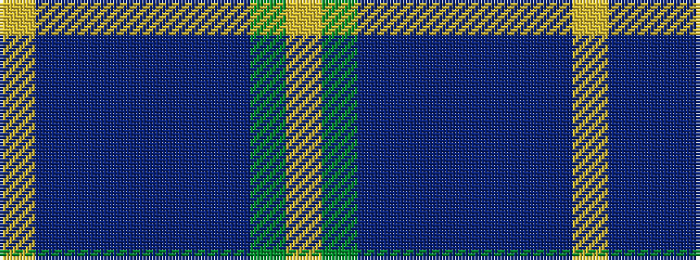

YBBBBBBGY

It is a 9 stripe tartan.

<figure class="pat-woven">

<figcaption>idealised sample</figcaption>
</figure>

## Colour Sequence



## Tartans with this colour sequence

| Tartans |
|---------------|
| [Children 1st (Corporate)](/setts/s9/ly7db32dp4db4dp8db4dp8g32ly3~x2/)|
||
