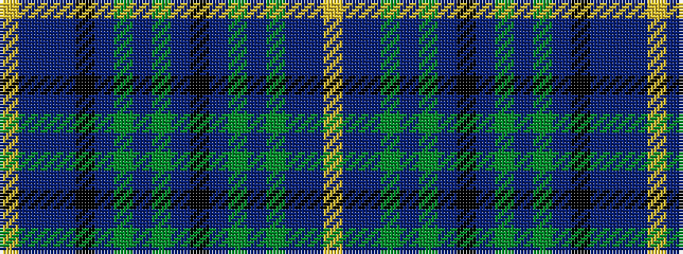

YBBBKBGBGBKBGBGBBY

It is a 18 stripe tartan.

<figure class="pat-woven">

<figcaption>idealised sample</figcaption>
</figure>

## Colour Sequence



## Tartans with this colour sequence

| Tartans |
|---------------|
| [LS Curling](/setts/s18/ly2db4dbi2g25dbi4g2dbi4k10db4g2db4g11dbi2k2dbi24db4dbi2ly2~x2/)|
||
