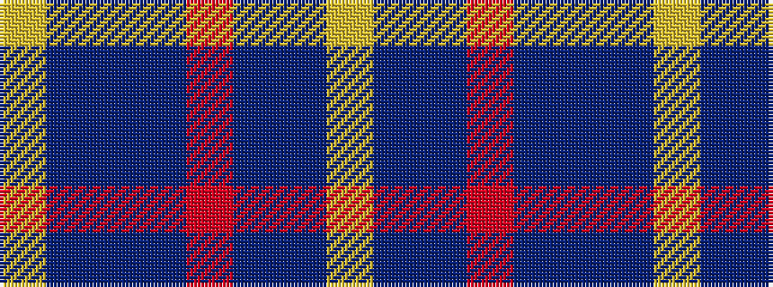

YBBBRBBY

It is a 8 stripe tartan.

<figure class="pat-woven">

<figcaption>idealised sample</figcaption>
</figure>

## Colour Sequence



## Tartans with this colour sequence

| Tartans |
|---------------|
| [Daks (Blue Loden)](/variants/s8/lo3t7do2m2do14t2do2lo3~x2/)|
||
