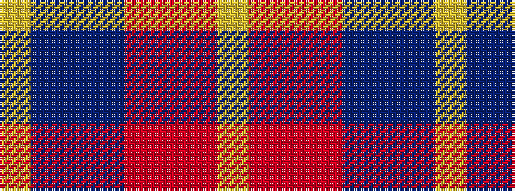

YBBBRRRY

It is a 8 stripe tartan.

<figure class="pat-woven">

<figcaption>idealised sample</figcaption>
</figure>

## Colour Sequence



## Tartans with this colour sequence

| Tartans |
|---------------|
| [Tache, Sir Etienne Paschal](/setts/s8/lr2r1r24r16dt20db3dt3lo2~x2/)|
||
