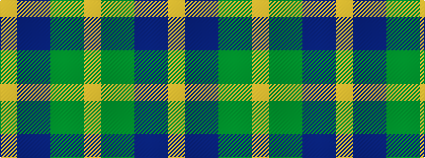

YBBGGY

It is a 6 stripe tartan.

<figure class="pat-woven">

<figcaption>idealised sample</figcaption>
</figure>

## Colour Sequence



## Tartans with this colour sequence

| Tartans |
|---------------|
| [MPS Emerald Society](/variants/s6/ly4dg30g15db5b10ly4~x2/)|
||
| [MPS Emerald Society NCLEES 2012](/variants/s6/ly4dg30g15db5t10ly4~x2/)|
||
