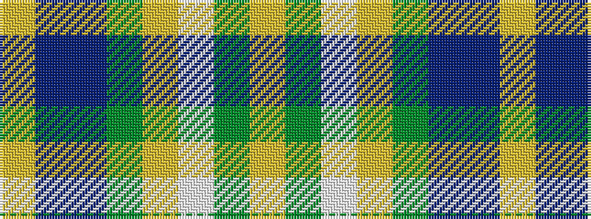

YBBGYWGY

It is a 8 stripe tartan.

<figure class="pat-woven">

<figcaption>idealised sample</figcaption>
</figure>

## Colour Sequence



## Tartans with this colour sequence

| Tartans |
|---------------|
| [Philpotts, Brian](/variants/s8/ly8t24db21g18loi4lb3dy2lo1~x2/)|
||
