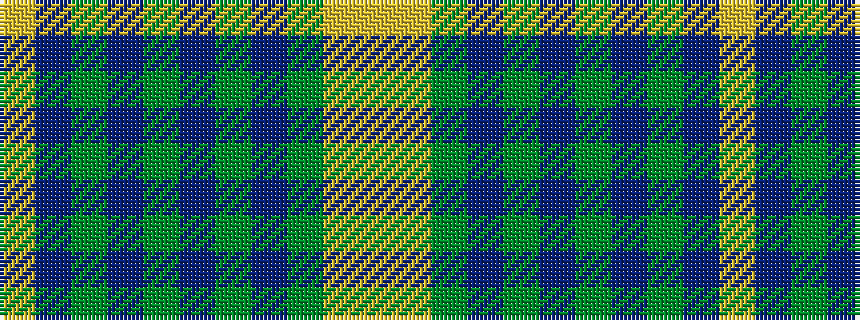

YBGBGBGBGYY

It is a 11 stripe tartan.

<figure class="pat-woven">

<figcaption>idealised sample</figcaption>
</figure>

## Colour Sequence



## Tartans with this colour sequence

| Tartans |
|---------------|
| [Bute Heather, Ancient Wth'd (Fashion](/setts/s11/lo5n2y8n1y8n4y4n6y18lr1lo5~x2/)|
||
