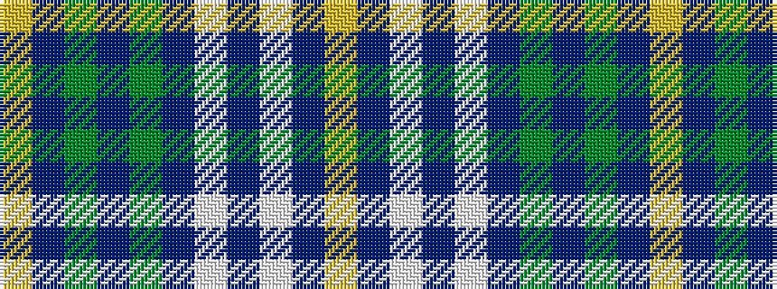

YBGBGBWBWBY

It is a 11 stripe tartan.

<figure class="pat-woven">

<figcaption>idealised sample</figcaption>
</figure>

## Colour Sequence



## Tartans with this colour sequence

| Tartans |
|---------------|
| [Robinson, Barbara Ann (Personal)](/setts/s11/ly2n16dg2n2dg16dp2w15t2w2t16ly2~x2/)|
||
