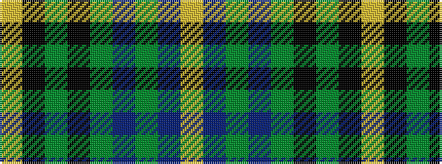

YBGBGKGKY

It is a 9 stripe tartan.

<figure class="pat-woven">

<figcaption>idealised sample</figcaption>
</figure>

## Colour Sequence



## Tartans with this colour sequence

| Tartans |
|---------------|
| [Henderson](/setts/s9/lr1db6dg4db1dg16k1dg4k6ly1~x2/)|
||
